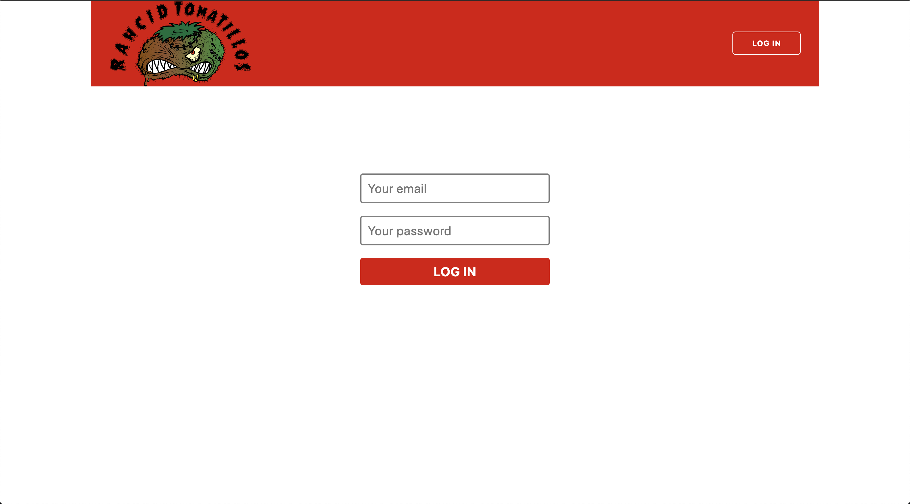

# Rancid Tomatillos
Contributors:

- Kyle Barnett
- Jeremy Poulter
- Jonathan Tschida
- Tanisha L. Davey

## Overview

This was a group project assigned during Mod 3 at Turing.  We were tasked with creating a movie rating web application.  Users can view information about a variety of movies, including their average rating among all users.  Additionally, a user can log in and add or change their own ratings of movies.

The goal of this project was to demonstrate our skill with the following:
 - React fundamentals
 - React Router
 - Testing components and asynchronous JavaScript
 - Navigating a shared, persistent API
 - Redux state management and testing

## Screenshots





## Set Up

To copy the project to your computer and run it:

1. clone down the repo using `git clone`
2. run `npm install`
3. run `npm start` to host a local server
4. your terminal should automatically navigate to [http://localhost:3000/](http://localhost:3000/), otherwise you can type it in your browser to view it.
5. You can log in with the following information:

    ```
    email: diana@turing.io
    password: 111111
    ```
